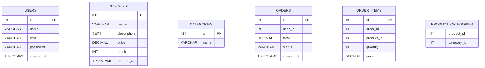
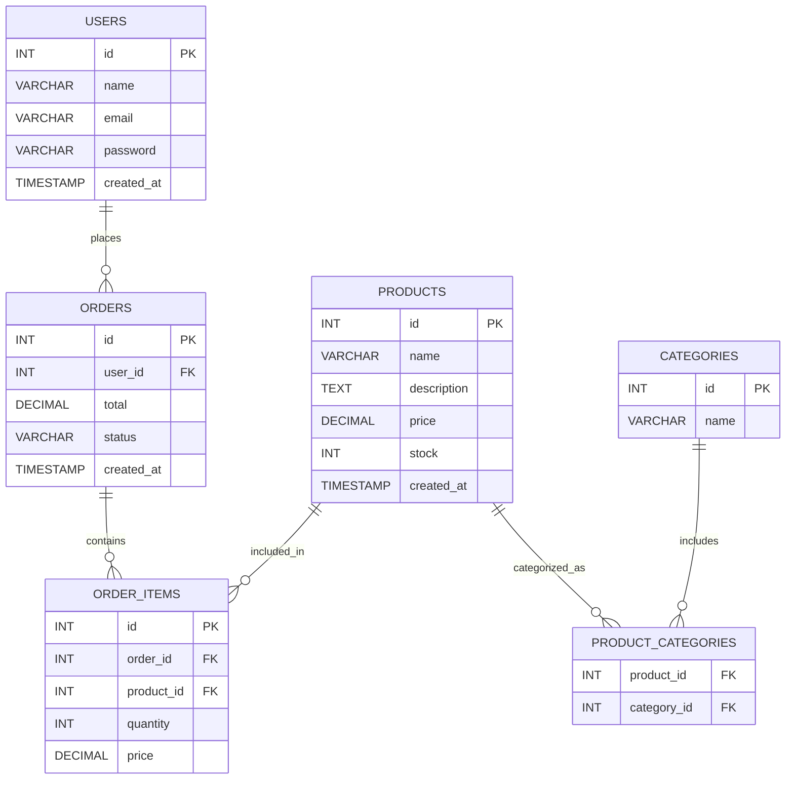
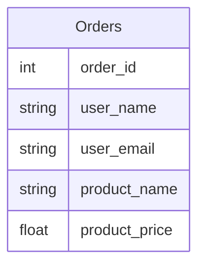
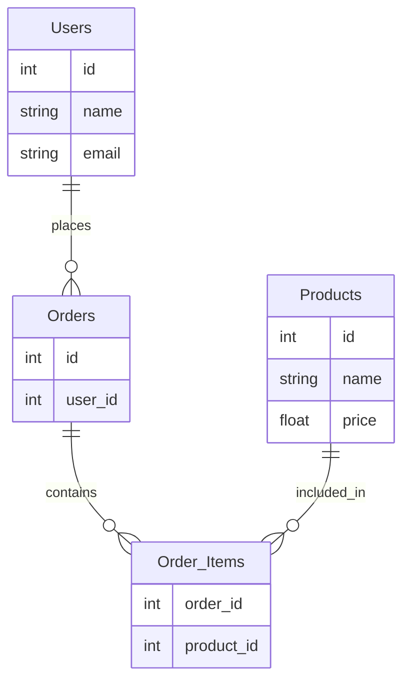

# Databases Essentials

<!--
1- introduction to database
1-1- what is database
1-2- database management system
1-3- Why we need databases (vs files)
2- Types of Databases
3- relational database
3-1- Tables and schema (column + rows)
3-2- types and Data Integrity & Constraints + keys
3-3- relationships
4- who to Design database + Normalization
5- SQL
6- Using Databases in Backend (Practical)
7- what are ORMs & ODMs -->

---

## introduction to database

### what is database

A database is an organized collection of data stored in a way that makes it easy to access, manage, and update.

- Instead of random files → everything is structured
- Data is stored in a way that can be queried efficiently

### Database Management System (DBMS)

A DBMS is software that allows you to interact with the database.

<!-- .jpg">) -->

.jpg>)

DBMS acts as a middle layer between your app and the data
It handles:

- Storage
- Queries
- Security
- Performance

📌 Examples:

- MySQL
- PostgreSQL
- MongoDB

### Why we need databases (vs files)

🚨 Problems with Files

1. 🔍 Searching is slow and inefficient

- To find a user → you must read the whole file
- No optimized search

2. 🔗 No relationships between data

- Users ↔ Orders
- Posts ↔ Comments

3. 👥 No concurrency (multi-users problem)

- What if 2 users write at the same time?
- Data can be overwritten or corrupted

4. ❌ Data inconsistency, No security, Not scalable...

> Files store data… Databases protect, organize, and optimize data

---

## 🏗️ Types of Databases

### Relational (SQL)

- Structured (tables)
- Fixed schema

### NoSQL

- Flexible schema

### 💡idea:

- SQL → structure & consistency
- NoSQL → flexibility & scalability

---

## 📊 Relational Database

### Tables and Schema

Table = like Excel sheet
Row = one record
Column = attribute

### Types + Data Integrity & Constraints + Keys

Data Types :

- INT
- VARCHAR
- FLOAT
- DATE

### Constraints (VERY IMPORTANT)

- NOT NULL → must have value
- UNIQUE → no duplicates
- DEFAULT → fallback value

### Keys 🔑

- primary kay (id) : Cannot be null + unique
- Foreign Key 🔗 : Links tables together

💡 Example:



### Relationships

#### One-to-One

User ↔ Profile

#### One-to-Many

User → Orders

#### Many-to-Many

Products ↔ Categories



## ⚙️ How to Design Database + Normalization

> Designing a good database = building scalable software

### Bad Design ❌



### Good Design ✅ – Normalized



### Step by step design:

- Identify entities (User, Product…)
- Define attributes
- Define relationships
- Add keys

---

## 🧮 SQL


### 🧱 DDL – Data Definition Language

DDL is used to define or modify the database structure: tables, columns, constraints.

#### Create table

```sql
CREATE TABLE Users (
    id INT PRIMARY KEY AUTO_INCREMENT,
    name VARCHAR(100) NOT NULL,
    email VARCHAR(150) NOT NULL UNIQUE,
    created_at TIMESTAMP DEFAULT CURRENT_TIMESTAMP
);
```

#### Alter Table (Add Column)

```sql
ALTER TABLE Users
ADD COLUMN phone VARCHAR(20);
```

#### Drop Table

```sql
DROP TABLE IF EXISTS Users;
```

### 🧾 DML – Data Manipulation Language

DML is used to work with data inside the tables: insert, update, delete, select.

#### Insert data

```sql
INSERT INTO Users (name, email)
VALUES ('mohamed', 'mohamed@example.com');
```

#### Update data

```sql
UPDATE Users
SET name = 'mohamed amine'
WHERE id = 1;
```

#### Delete data

```sql
DELETE FROM Users
WHERE id = 1;
```

## 🌐 Using Databases in Backend (Practical)

Flow:
Client → Backend → Database → Backend → Client

example:
Get all products

```js
const products = await db.query("SELECT * FROM products");
```
